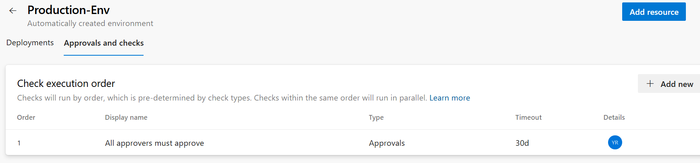
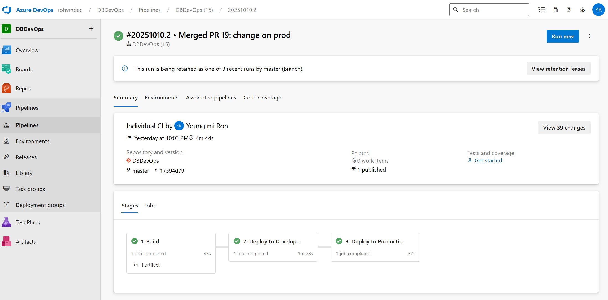
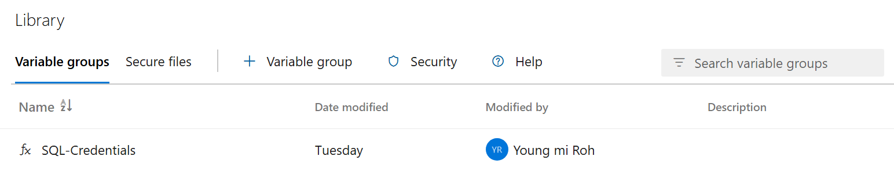
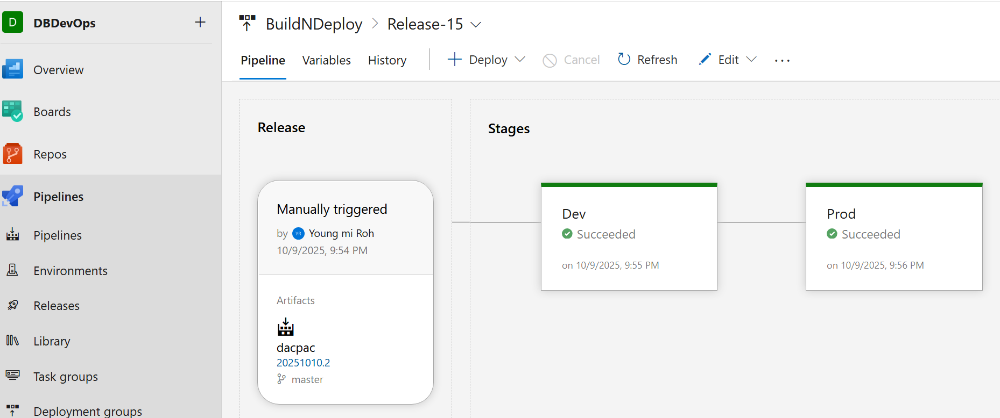
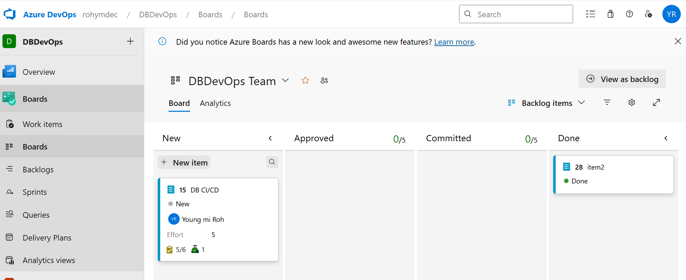

# Azure DevOps CI/CD for SQL Project


## Overview
This project implements a fully automated CI/CD pipeline for a SQL Server Database Project using **Azure DevOps YAML pipelines**.

It is designed with two separate workflows:

  * One for Pull Request validation to ensure code quality before merging.
  * Another for building and deploying across Development and Production environments.


## Pipeline Architecture
This diagram illustrates the two separate pipeline flows based on Git branch activity.

```
(feature branch commit)
      │
      ▼
[Pull Request -> master]
      │
      ├─ Trigger: prValidation.yml
      │   └─ SQL project build validation (no deployment)
      │
      ▼ (validation passed -> PR merged)
[master branch update]
      │
      ├─ Trigger: azure-pipelines.yml
      │   ├─ Stage 1: Build (generate and publish DACPAC artifact)
      │   ├─ Stage 2: DeployDev (automatic deployment)
      │   └─ Stage 3: DeployProduction (manual approval required)
```
Added data check step after deploying to Dev DB

## Files
| File | Description |
| :--- | :--- |
| **prValidation.yml** | Executes build validation during Pull Requests. No deployment. |
| **azure-pipelines.yml** | Runs full CI/CD when master branch is updated (Build -\> Dev -\> Prod). |
| **DBDevOps.sqlproj** | Visual Studio SQL Project used to generate the DACPAC artifact. |


## CI/CD Flow
This flow highlights the security and quality gates implemented in the pipeline.

### 1\. PR Validation
  * **Triggered** automatically when a Pull Request targets the `master` branch.
  * **Runs** SQL project build validation to ensure no compilation or schema issues.
  * **No deployment** steps are included.

### 2\. Build & Deployment
  * **Triggered** when a PR is merged into `master`.
  * **Stage 1 (Build):** Builds the DACPAC and publishes it as a pipeline artifact.
  * **Stage 2 (DeployDev):** Automatically deploys the DACPAC to the **Development environment**.
  * **Stage 3 (DeployProduction):** Requires **manual approval** for deployment to **Production** environment.
  
  

## Security & Configuration
### Variable Group: SQL-Credentials
  * Stores environment variables such as server names and authentication info securely.
  
  
### Service Connection: ServiceConnection1
  * Azure service principal used for deploying DACPAC to Azure SQL Database.


## Key Features
  * **Separated pipelines** for validation and deployment, ensuring a clean CI process.
  * **Automated DACPAC build** and artifact publishing for consistency and traceability.
  * **Environment-based deployment** with manual approvals for Production, providing necessary control.
  * **YAML-based configuration** aligned with enterprise DevOps standards.


## Option2: Classic Release Pipeline(GUI Implementation)


## Boards
